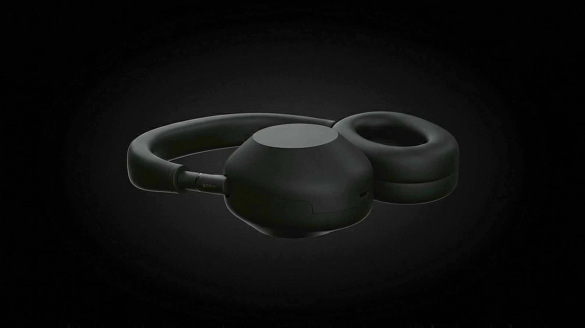

# PURUSH AI - Sony WH-1000XM6 Cinematic Experience

A high-performance, cinematic scrollytelling landing page for the Sony WH-1000XM6 headphones. Built with **Next.js 14**, **Tailwind CSS**, and **Framer Motion**, featuring an ultra-premium dark mode aesthetic and hardware-accelerated scroll interactions.



## 🌟 Key Features

- **Cinematic Scrollytelling**: 232-frame 3D image sequence that disassembles the product in real-time.
- **Seamless Blending**: Interactive canvas animation that perfectly matches the "OLED black" background.
- **Premium Aesthetics**: Apple-style glassmorphism navbar, custom gradient buttons, and editorial typography.
- **Immersive Story:** Synchronized copywriting reveals engineering stats, noise-cancelling tech, and sound quality as you scroll.

## 🛠️ Tech Stack

- **Framework**: Next.js 14 (App Router)
- **Styling**: Tailwind CSS
- **Animation**: Framer Motion & HTML5 Canvas
- **Language**: TypeScript

## 🚀 Getting Started

1. **Install dependencies:**
    ```bash
    npm install
    ```

2. **Run the development server:**
    ```bash
    npm run dev
    ```

3. **Open:** [http://localhost:3000](http://localhost:3000)
